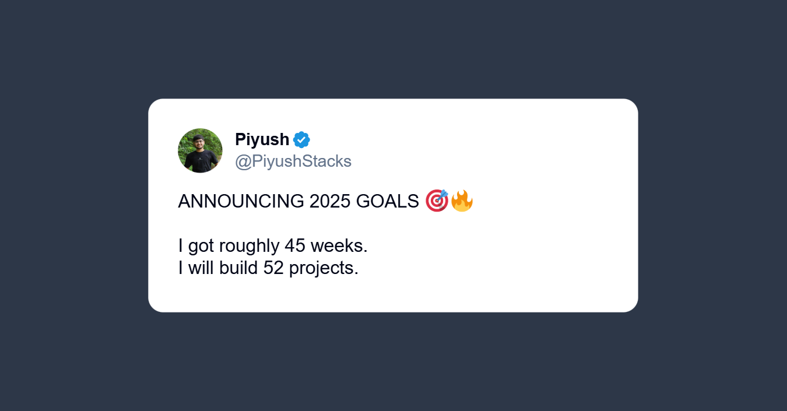

## Hi there👋!  

I'm [**Piyush**](https://piyushbhagchandani.me/), a software engineer from Ahmedabad, India.

I'm primarily interested in full-stack development and currently working on some cool projects. 

Outside of work, I'm interested in following the developments of science. Also, I love to read books and create content.

### Let's connect!

   
 

  
